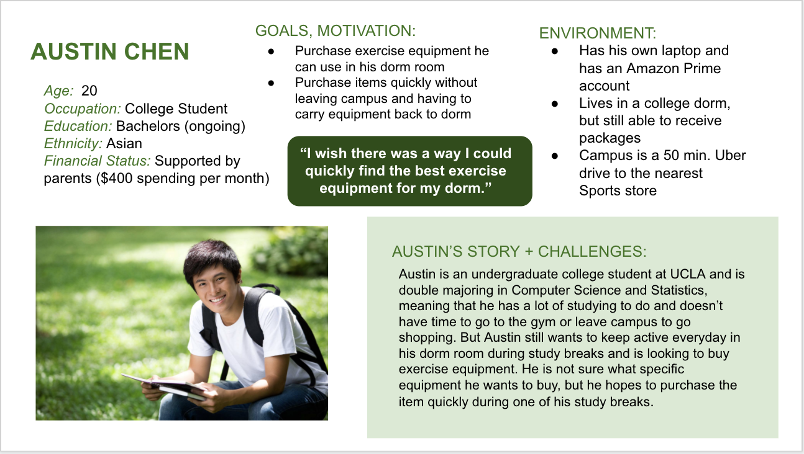
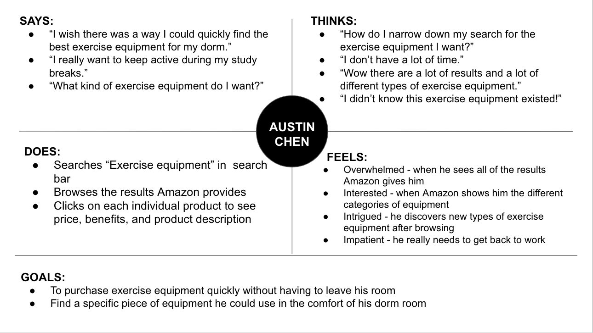
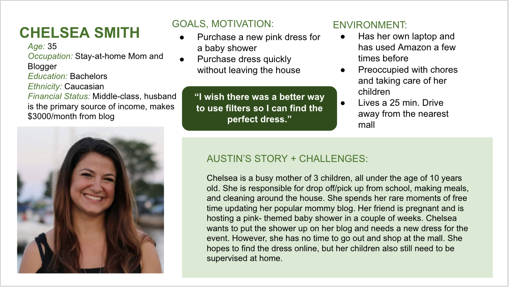
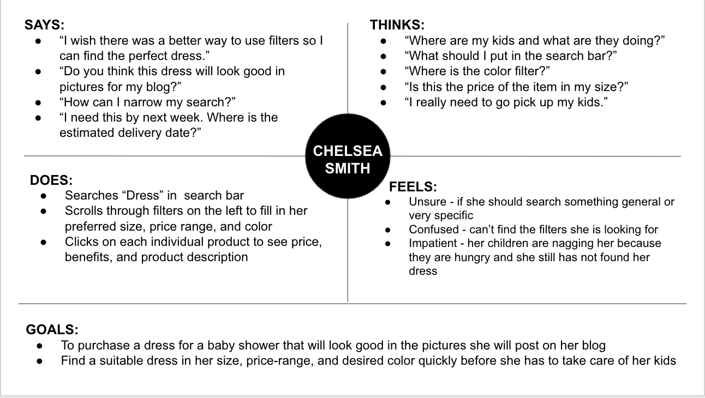
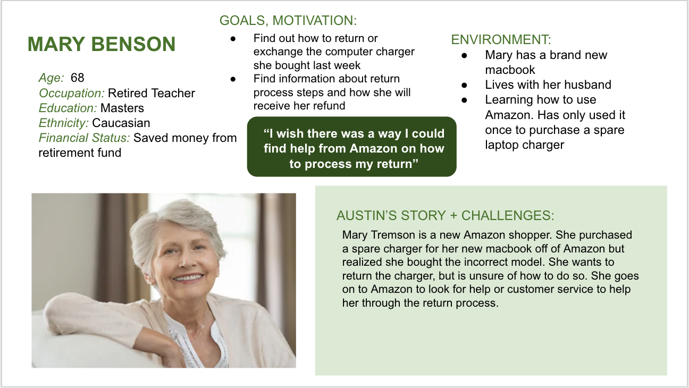
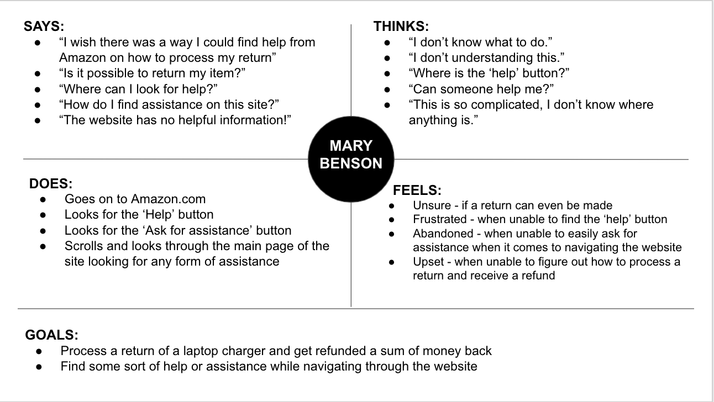

# DH150-ASSIGNMENT05
## Purpose of UX Storytelling
UX storytelling puts a human face on dry data and research and ensures that the improvements made in the product are user-centered. A good experience is like telling a good story - it places our product into a scenerio and allows us to visualize our product being used. From there, we will be able to understand why our product is used, how it can be used to resolve conflicts in our user's lives, and how users may feel when they use the product. UX storytelling requires developers to define the user and create stories around them and their goals. Developers are able to empathize with these personalized stories to better understand their user's emotional experiences as they use the product. In all, UX storytelling provides insight into potential users, allows for a simplified and personable method of presenting product information, and highlights the potential user scenerios applicable to the product.

## Design Features
1. Filters - make filters collapsable by category so all different filter choices are visible on one screen and can be used when needed

2. Results Categorization - breaks down a large list of results into sub-categories that group together similar items

3. Help and Contact Amazon - a clear help button that will allow users to find hidden or hard-to-find pages and an easy way to contact Amazon asking for support

## Persona and Empathy Maps
1. Austin Chen

2. Chelsea Smith

3. Mary Benson

## Scenerios and Jounrey Maps
